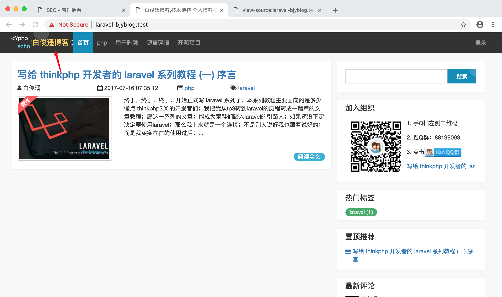
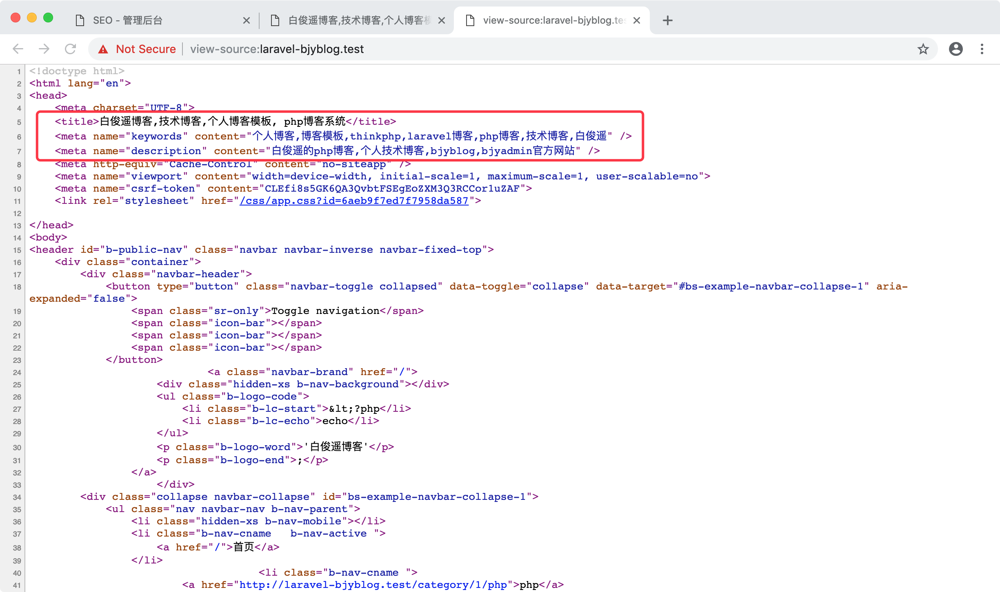

SEO 配置：  
  
是否使用 Slug 的 URL 差异:  
类型 | 不使用 slug | 使用 slug
--- | --- | ---
分类 | https://baijunyao.com/category/1 | https://baijunyao.com/category/1/php
标签 | https://baijunyao.com/tag/1 | https://baijunyao.com/tag/1/git
文章 | https://baijunyao.com/article/1 | https://baijunyao.com/article/1/use-jwt
网站名：  
  
标题、关键字、描述：  
  