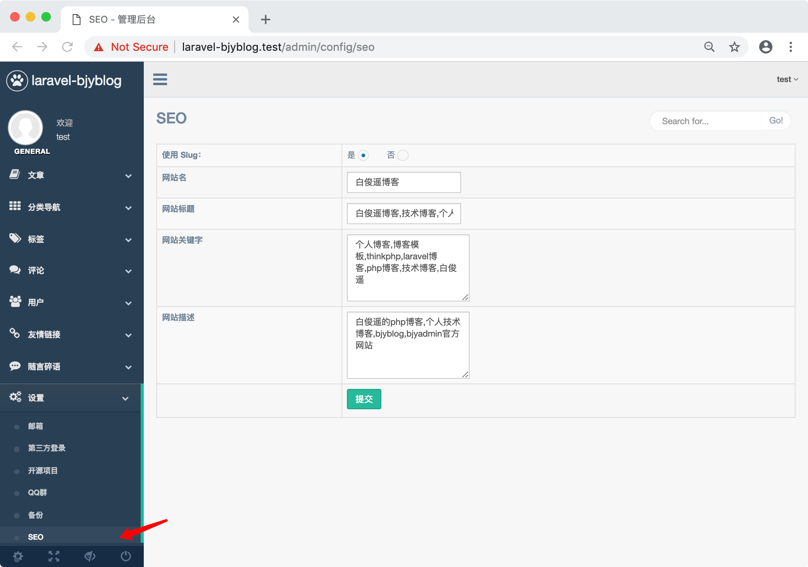
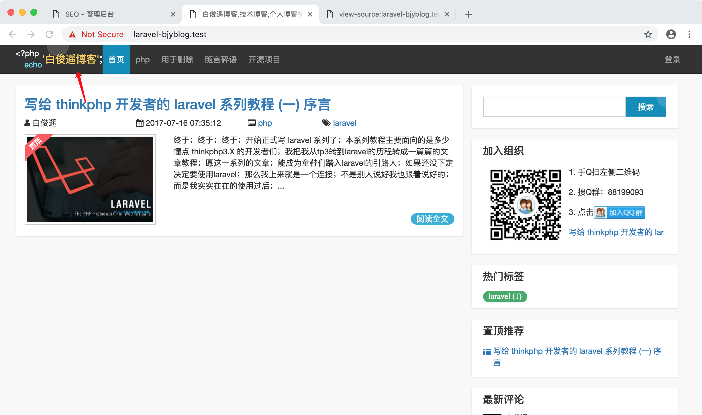
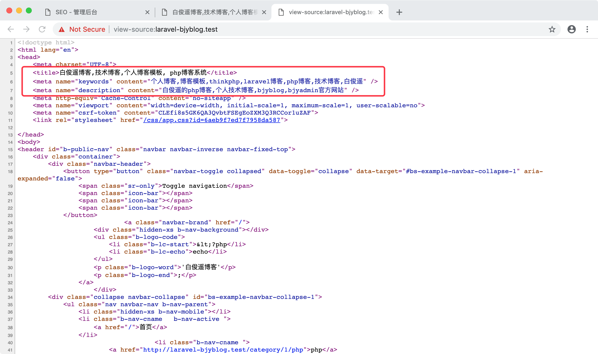

SEO configs:    
  
Type | Not use slug | Use slug
--- | --- | ---
Category | https://baijunyao.com/category/1 | https://baijunyao.com/category/1/php
Tag | https://baijunyao.com/tag/1 | https://baijunyao.com/tag/1/git
Article | https://baijunyao.com/article/1 | https://baijunyao.com/article/1/use-jwt
App name:    
  
Title, keywords, description:    
  