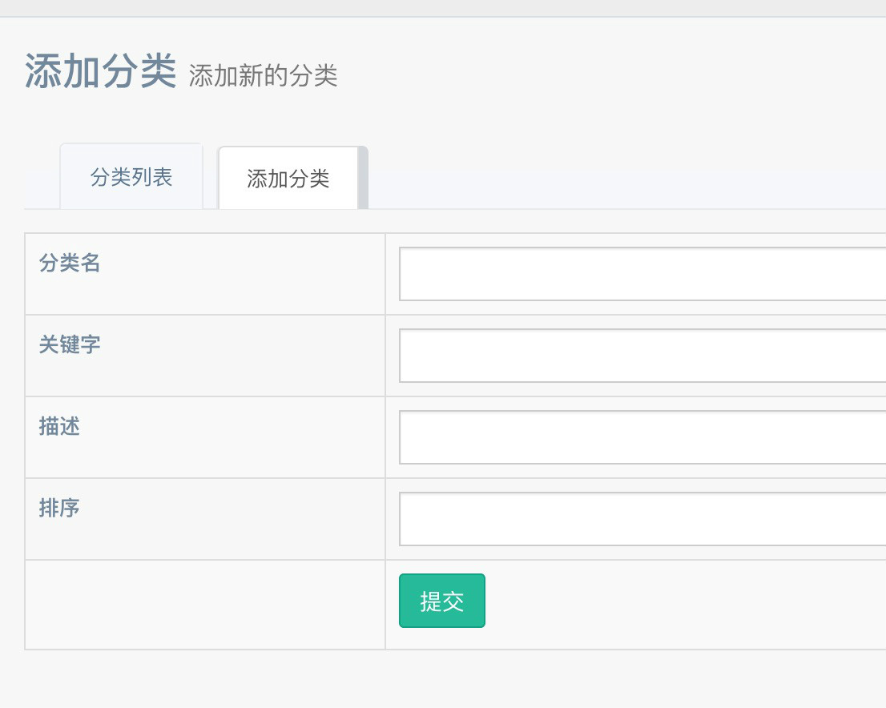

顶部导航分为`分类`和`菜单`两部分；  
以白俊遥博客为例；  
前面这部分是在后台添加的分类；  
  
分类会自动在前台展示；  
新增分类时候需要填写如下字段；  

| 名称 | html |
| --- | ---- |
| 分类名 | title |
| 关键字 | keywords | 
| 描述 | description | 
以上信息有利于 SEO ；
`排序` 字段用于分类之间的先后顺序；  