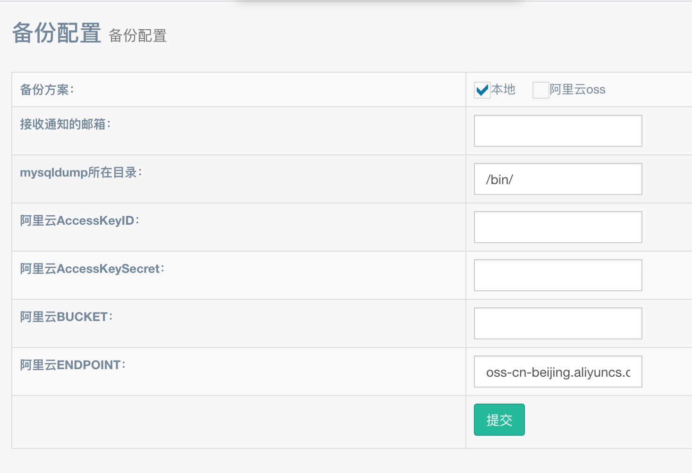

博客内置了备份功能用于备份代码和和数据库；  
  
可以选择备份到本地和阿里云OSS；  
默认在每天凌晨2点自动备份；  
也可以选择手动执行如下命令备份；  
```bash
php artisan backup:run
```
备份成功后本地会存储在 /storage/app/daily-backup 目录;  
| 名称 | 描述 | 
| --- | ---- |
| 接收通知的邮箱 | 用于接收备份结果的邮箱 | 
| mysqldump所在目录 | 可以通过 which mysqldump 获取 | 
| 阿里云AccessKeyID | 参考阿里云 OSS 文档 | 
| 阿里云AccessKeySecret | 参考阿里云 OSS 文档 | 
| 阿里云BUCKET | 参考阿里云 OSS 文档 | 
| 阿里云ENDPOINT | 参考阿里云 OSS 文档 | 

获取mysqldump所在目录: [linux查看nginx、apache、php、php-fpm、mysql及配置项所在目录](https://baijunyao.com/article/146)  
阿里云oss： [官方文档](https://help.aliyun.com/product/31815.html?spm=5176.7933691.744462.c2.48ed6a56ze8y4p)  
oss需要付费如果购买可以先在福利专区领红包：  [福利专区](https://baijunyao.com/article/171)  