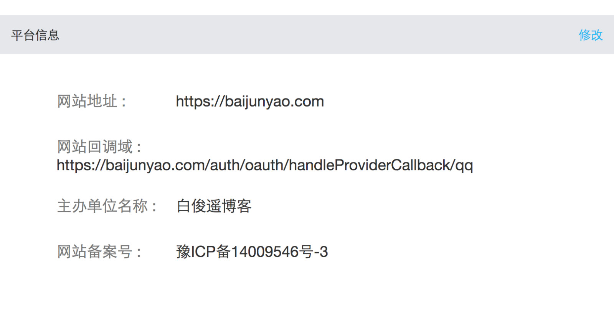
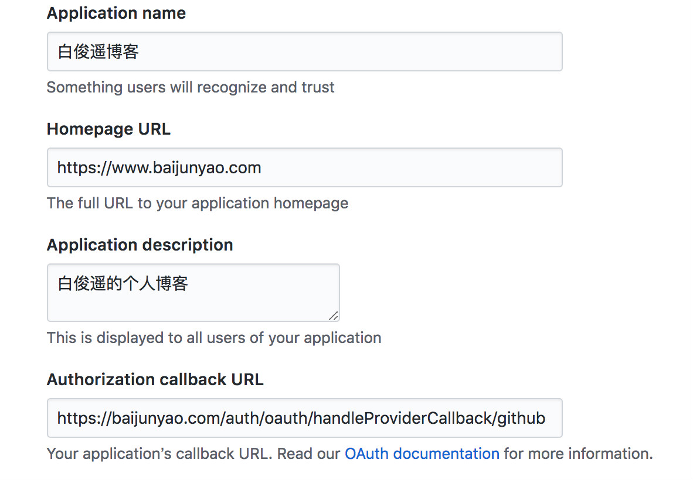

已经实现了QQ、微博、github登录；  
需要在各平台填写回调地址；  
可以照着我的抄；  
把域名改成自己的就可以了；  
QQ：`https://baijunyao.com/auth/oauth/handleProviderCallback/qq`  
  

github：`https://baijunyao.com/auth/oauth/handleProviderCallback/github`  
  

微博：填写域名就行了；