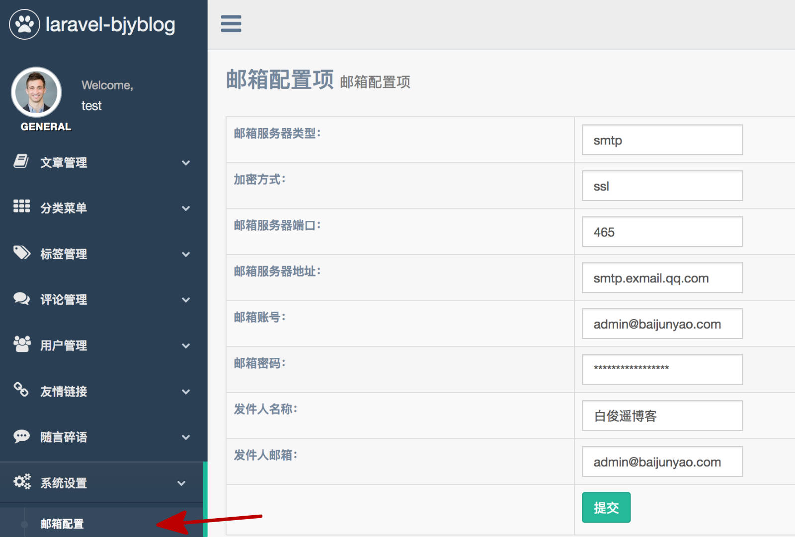

邮箱配置用于邮件通知功能；  
比如说评论通知；  
下图是我的示例配置；  
 
发送邮件需要开通 SMTP ；  
各邮箱平台的开通方式可以参考之前的文章；  
[thinkphp整合系列之phpmailer批量发送邮件](https://baijunyao.com/article/69) ；  
后台中的配置和 .env 文件中的配置对照关系如下；
| 后台配置 | .env |
| ---- | ---- |
| 邮箱服务器类型 | MAIL_DRIVER |
| 加密方式 | MAIL_ENCRYPTION | 
| 邮箱服务器端口 | MAIL_PORT |
| 邮箱服务器地址 | MAIL_HOST |
| 邮箱账号 | MAIL_USERNAME |
| 邮箱密码 | MAIL_PASSWORD |
| 发件人名称 | MAIL_FROM_NAME |
| 发件人邮箱 | MAIL_FROM_ADDRESS |
只需要在后台配置即可；  
不需要在 .env 中配置；